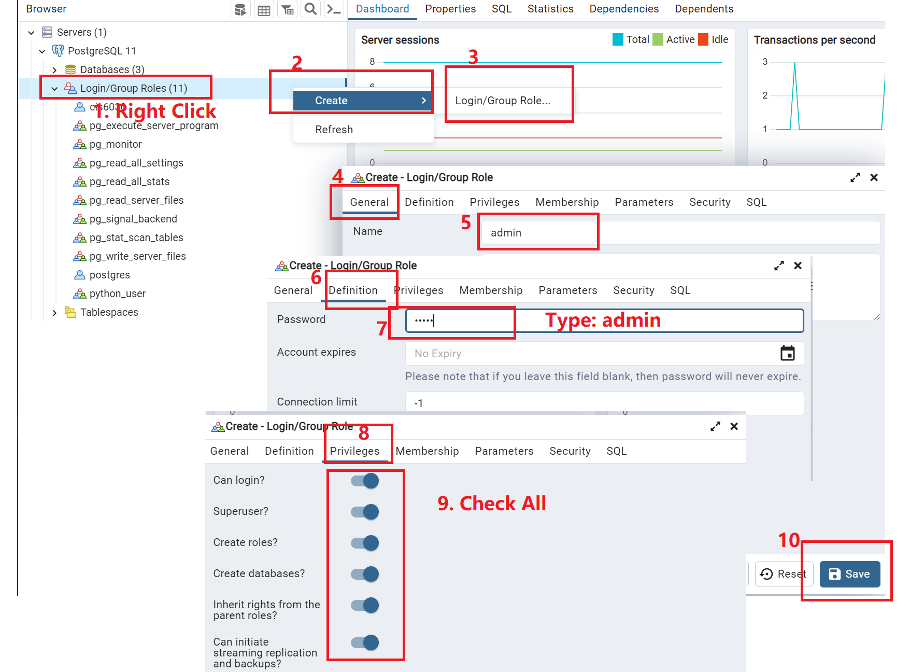
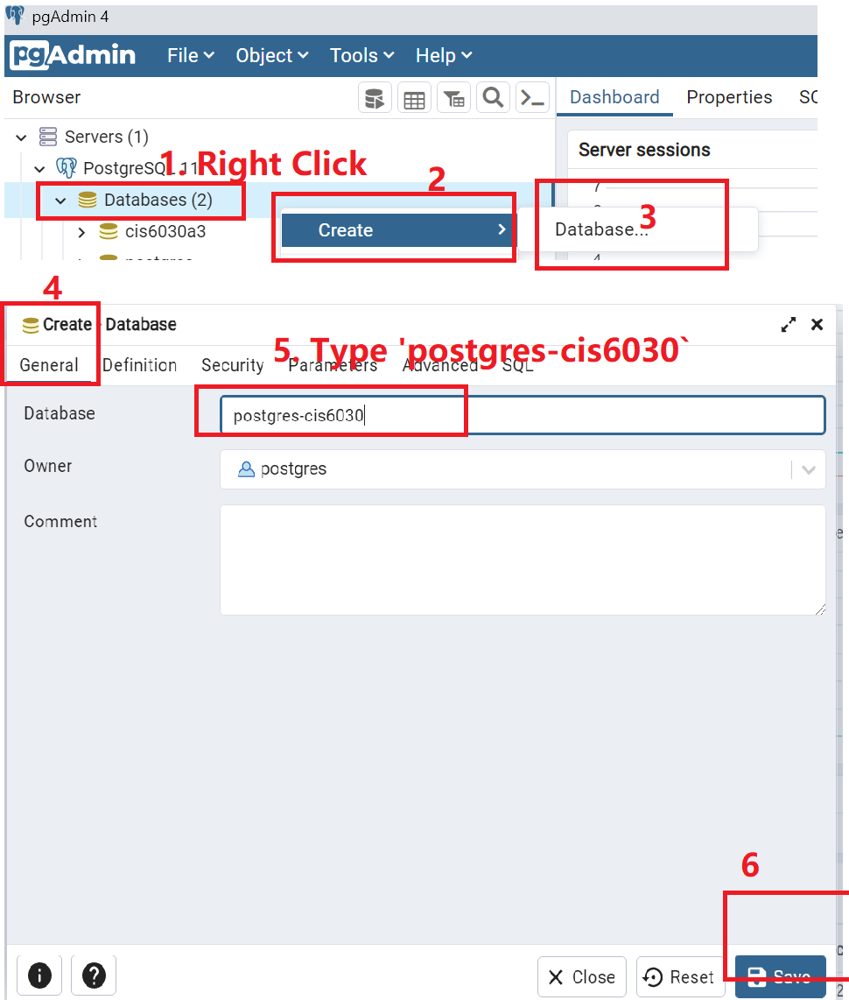
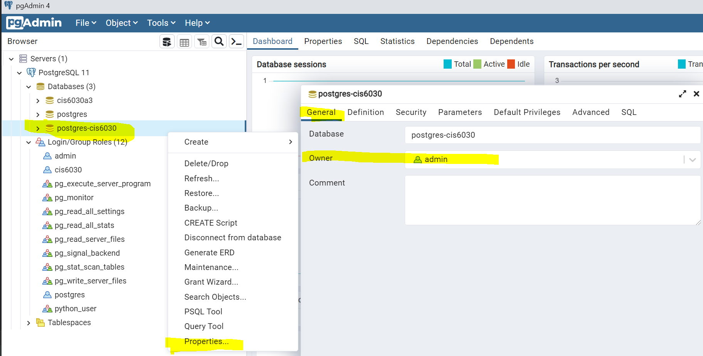

# CIS6030 A3 PostgreSQL
Yaowen Mei (1177855)

## Setup PostreSQL Environment
1. Assume you already have PostgreSQL and pgAdmin installed. Then if you want to create new user and database, please fllow steps 2 to 4; Otherwise, you can jump to step 5 to use existing username and database.
2. Set up a user `admin` with password `admin` 
3. Set up a database name `postgres-cis6030` 
4. Set user `admin` to be the owner of the database `postgres-cis6030` 
5. You are completely done with this step now. However, alternatively, if you do not want to create new user/database, and just want to use your existing user and database, you can do so by change the `YourConstant.py` file:
```python
USER_NAME = "admin" # change to your existing username
USER_PASSWORD = "admin" # change to your password
DATABASE_NAME = "postgres-cis6030" # change to a database that your username has ownership
```

## Setup Python Environment 
1. You can use Python 3.7. 3.8, or 3.9:
* to set-up environment with `pip3`, follow step 2 and 3; 
* to set-up environment with `conda`, please follow step 4, 5; 
2. Make sure you have `pip3` installed already; otherwise, you will need to execute the command below in your terminal:

```
sudo apt install python3-pip
```

You can verify pip3 is installed by: 

```
pip3 --version
```
3. Install all the dependency from the `requirement.txt file`

```buildoutcfg
pip3 install -r requirements.txt
```
4. (If you decide to use conda instead of Pip3) Setup a conda environment: `conda env create --file 6030a3.yml`
5. Inside the conda environment, if your conda has hard time to install `PrettyTable`, then you might need to manually install the `PrettyTable` dependency:
```buildoutcfg
pip install -U git+https://github.com/jazzband/prettytable
```

---

## Assignment Requirements
### Question-1
1. run `main.py` to upload all the csv rows to your database under a table called `admission`
```python
>> python ./main.py
```
2. run `SQLOperations.py` to perform queries on the table. For Example:
```python
>> python ./SQLOperations.py
>> SELECT * FROM admission WHERE "TOEFL_Score" > 119
+------------+-----------+-------------+-------------------+-----+------+------+----------+------------------+
| Serial_No. | GRE_Score | TOEFL_Score | University_Rating | SOP | LOR_ | CGPA | Research | Chance_of_Admit_ |
+------------+-----------+-------------+-------------------+-----+------+------+----------+------------------+
|    26.0    |   340.0   |    120.0    |        5.0        | 4.5 | 4.5  | 9.6  |   1.0    |       0.94       |
|    82.0    |   340.0   |    120.0    |        4.0        | 5.0 | 5.0  | 9.5  |   1.0    |       0.96       |
|    98.0    |   331.0   |    120.0    |        3.0        | 4.0 | 4.0  | 8.96 |   1.0    |       0.86       |
|   144.0    |   340.0   |    120.0    |        4.0        | 4.5 | 4.0  | 9.92 |   1.0    |       0.97       |
|   203.0    |   340.0   |    120.0    |        5.0        | 4.5 | 4.5  | 9.91 |   1.0    |       0.97       |
|   204.0    |   334.0   |    120.0    |        5.0        | 4.0 | 5.0  | 9.87 |   1.0    |       0.97       |
|   213.0    |   338.0   |    120.0    |        4.0        | 5.0 | 5.0  | 9.66 |   1.0    |       0.95       |
|   298.0    |   320.0   |    120.0    |        3.0        | 4.0 | 4.5  | 9.11 |   0.0    |       0.86       |
|   498.0    |   330.0   |    120.0    |        5.0        | 4.5 | 5.0  | 9.56 |   1.0    |       0.93       |
+------------+-----------+-------------+-------------------+-----+------+------+----------+------------------+


>> SELECT "SOP","Research" FROM admission WHERE "TOEFL_Score" > 119 
+-----+----------+
| SOP | Research |
+-----+----------+
| 4.5 |   1.0    |
| 5.0 |   1.0    |
| 4.0 |   1.0    |
| 4.5 |   1.0    |
| 4.5 |   1.0    |
| 4.0 |   1.0    |
| 5.0 |   1.0    |
| 4.0 |   0.0    |
| 4.5 |   1.0    |
+-----+----------+

>> SELECT "Serial_No.",  "SOP","LOR_" FROM admission WHERE "Research" = 1 
+------------+-----+------+
| Serial_No. | SOP | LOR_ |
+------------+-----+------+
|    1.0     | 4.5 | 4.5  |
|    2.0     | 4.0 | 4.5  |
|    3.0     | 3.0 | 3.5  |
|    4.0     | 3.5 | 2.5  |
|    6.0     | 4.5 | 3.0  |
|    7.0     | 3.0 | 4.0  |
...

```

---
### Question-2 (Linear Regression)
1. run `MultiVariableLinearRegression.py` to train linear regression model.
When this Python program is running, 80% of data in the database will be randomly choose to train the linear regression model, and the remaining 20% of data will be used as the testing data.

For example, under a particular run (as shown below), the trained model is:

Admission = -1.379 + 0.0024*GRE_Score + 0.00229*TOFEL_Score + 0.00536*University_Rating + 0.00094*SOP + 0.017*LOR_ + 0.1164*CGPA + 0.018*Research

From the 20% testing data:
* We found that the Linear Regression Coefficient (R^2) is 0.789, which is close to 1, and indicating that 78.9% of the variance of the testing data is explained by the trained model,
* We also report that the Mean Squared Error is 0.0048 (close to zero), and this indicating that the absolute fit of the trained model to the testing data. 
```python
>> python ./MultiVariableLinearRegression.py

====================================================================================================
Welcome to the "Multivariable Linear Regression Section", below is the detailed trained model (80% training data and 20% testing data)
Based on the training data (80% of the 500 records), I have found that: 
===============================================================
Intercept:  -1.379006053404988
Coefficient for GRE_Score :  0.002433428957683443
Coefficient for TOEFL_Score :  0.0022932351104176553
Coefficient for University_Rating :  0.005361646439844125
Coefficient for SOP :  0.0009381892820456178
Coefficient for LOR_ :  0.017018845028744727
Coefficient for CGPA :  0.11637948605049521
Coefficient for Research :  0.01814735409088931
===============================================================
Based on the testing data (20% of the 500 records), I have found that:
R^2 score of the trained regression function is 0.7893103373057453
Mean Squared Error is  0.004845986548868848
===============================================================

```

2. Press p to make a new prediction, and type q to quite this program:

```python
===============================================================
[Press p to make a new prediction, type q to quit]: p
>> Please input GRE_Score [int out of 340]: 340
>> Please input TOEFL_Score [int out of 120]: 120
>> Please input University_Rating [int out of 5]: 5
>> Please input SOP strength [double out of 5]: 5
>> Please input LOR strength [double out of 5]: 5
>> Please input cGPA [double out of 10]: 10
>> Please input Research Experience [either 0 or 1]: 1
===============================================================
Please confirm your input:
+-----------+-------------+-------------------+-----+------+------+----------+
| GRE_Score | TOEFL_Score | University_Rating | SOP | LOR_ | CGPA | Research |
+-----------+-------------+-------------------+-----+------+------+----------+
|    340    |     120     |         5         | 5.0 | 5.0  | 10.0 |    1     |
+-----------+-------------+-------------------+-----+------+------+----------+
[Press Y to confirm, any other key to re-input]:
>> Y
Input is confirmed, calculating the admission rate from the trained model now: 
===============================================================
The predicted admission result is: 1 ( actual value is 1.0220836238065152)
===============================================================
```

Note that in the example above, the input student is a "excellent" student (better than any other student in the training data), therefore, the actual predicated admission is greater than 1. 
Due to the fact that probility should be in the range of [0, 1], for these edge cases, I reported the predicted admission to be 1 (actual value is reported as well for reference purpose).


---

### Question-3 (Logistic Regression)
1. run `LogisticRegression.py` to train logistic regression model.  When this Python program is running, 80% of data in the database will be randomly choose to train the logistic regression model, and the remaining 20% of data will be used as the testing data.
- If a student's admission rate is higher than 50%, we classify the student as admitted ( admission result is: True), 
- If a student's admission rate is lower than 50%, we classify the student as rejected ( admission result is: False).

For example, under a particular run (as shown below), after training, from the 20% testing data:

We found that:
* The Alpha Risk (the risk of the model incorrectly reject a good student) is 1%
* The Beta Risk (the risk of the model incorrectly accept a bad student) is 8%
* The Confidence Level = 1 - Alpha Risk = 99%
* The Power = 1 - Beta risk = 92%

We found that the model can predict the admission status of a student with high confidence level (99%) and Power (92%), and the Type I Error (False Positive) is as low as 1%, 
and the Type II Error (False Positive) is as low as 8%. Therefore, this logistic regression model is accurate.

```python
>>python ./LogisticRegression.py
====================================================================================================
Welcome to the "Logistic Regression Section", below is the detailed trained model (80% training data and 20% testing data)
Based on the training data (80% of the 500 records), I have found that the model is: 
===============================================================
Intercept:  -46.45068118820522
Coefficient for GRE_Score :  0.05391191575982936
Coefficient for TOEFL_Score :  0.1158829787501167
Coefficient for University_Rating :  -0.07594020337412612
Coefficient for SOP :  -0.38151290938721244
Coefficient for LOR_ :  0.7857108381589791
Coefficient for CGPA :  2.3957217012402148
Coefficient for Research :  0.09234672875127393
===============================================================
Based on the testing data (20% of the 500 records), I have found that:
Accuracy is 91.0 %
Confusion Matrix:
+---------------+----------------+---------------+
|     Label     | Predict_Reject | Predict_Admit |
+---------------+----------------+---------------+
| Actual_Reject |       2        |       8       |
|  Actual_Admit |       1        |       89      |
+---------------+----------------+---------------+

```
2. Press p to make a new prediction, and type q to quite this program

```python
>> [Press p to make a new prediction, type q to quit]: p
>> Please input GRE_Score [int out of 340]: 340
>> Please input TOEFL_Score [int out of 120]: 120
>> Please input University_Rating [int out of 5]: 5
>> Please input SOP strength [double out of 5]: 5
>> Please input LOR strength [double out of 5]: 5
>> Please input cGPA [double out of 10]: 10
>> Please input Research Experience [either 0 or 1]: 1
===============================================================
Please confirm your input:
+-----------+-------------+-------------------+-----+------+------+----------+
| GRE_Score | TOEFL_Score | University_Rating | SOP | LOR_ | CGPA | Research |
+-----------+-------------+-------------------+-----+------+------+----------+
|    340    |     120     |         5         | 5.0 | 5.0  | 10.0 |    1     |
+-----------+-------------+-------------------+-----+------+------+----------+
[Press Y to confirm, any other key to re-input]:
Y
Input is confirmed, please wait while training the model...
===============================================================
The predicted admission result is: True
===============================================================

```