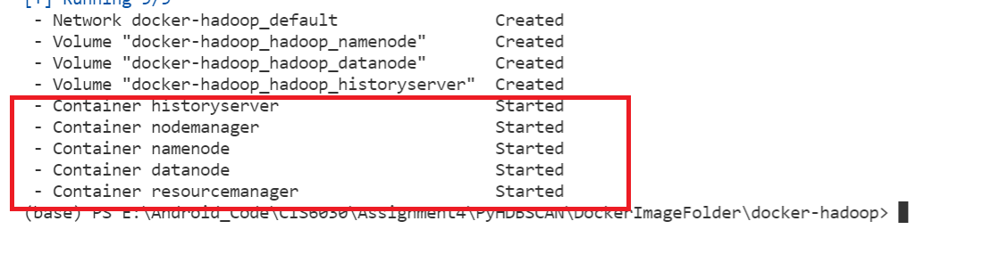
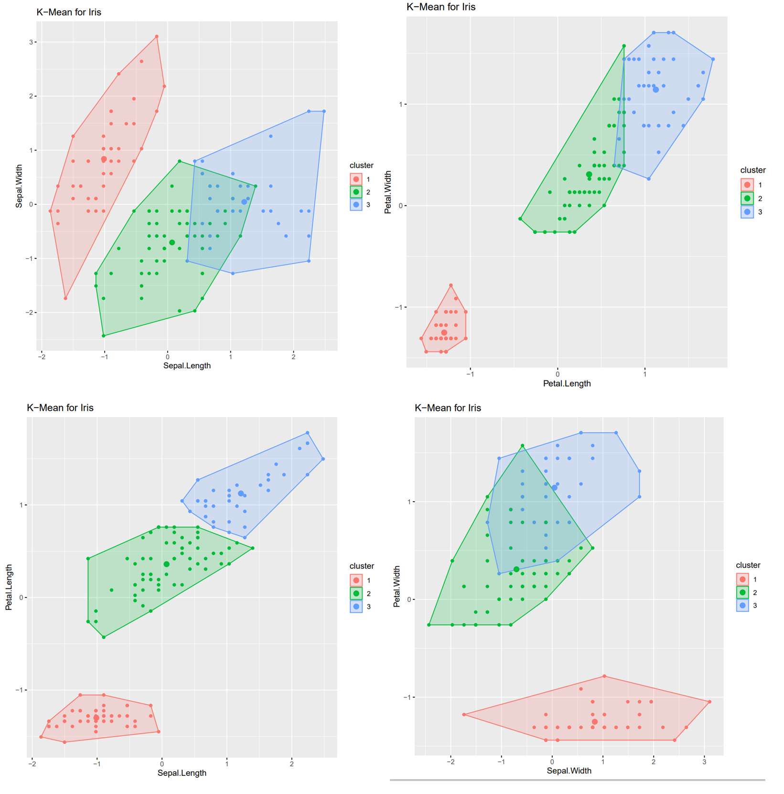
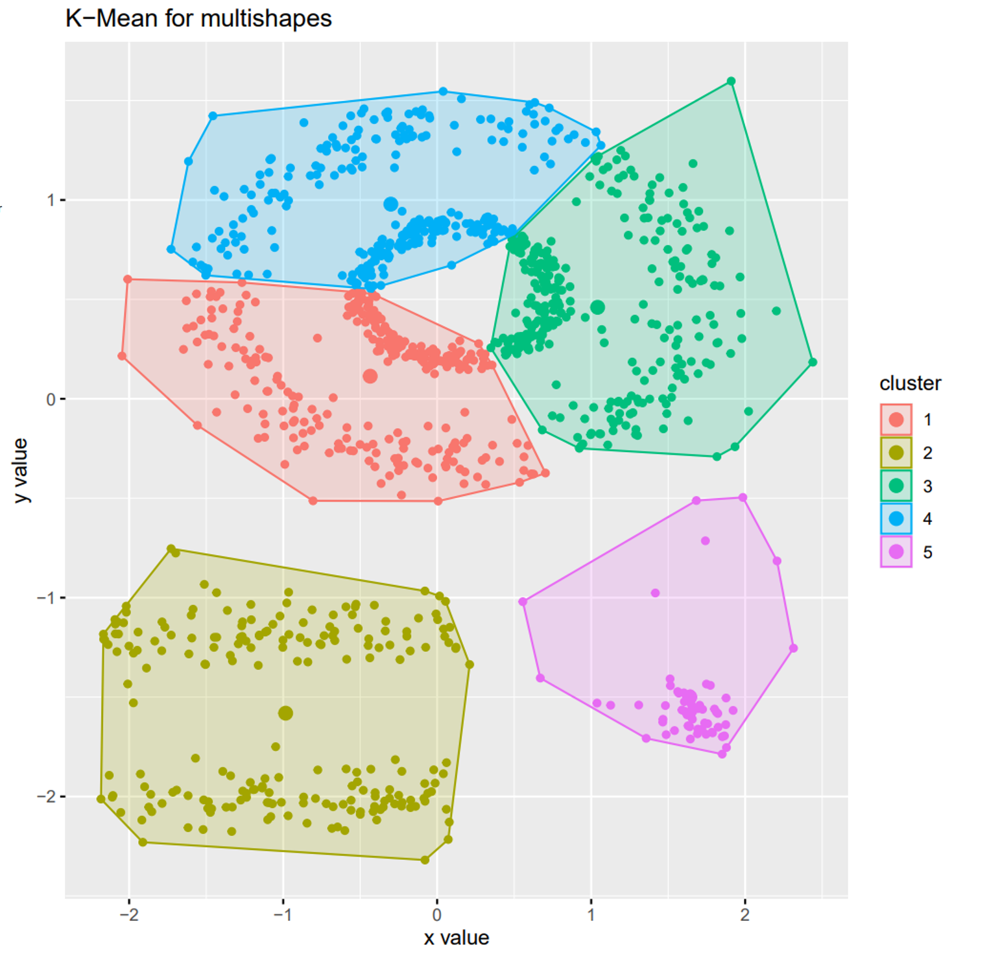
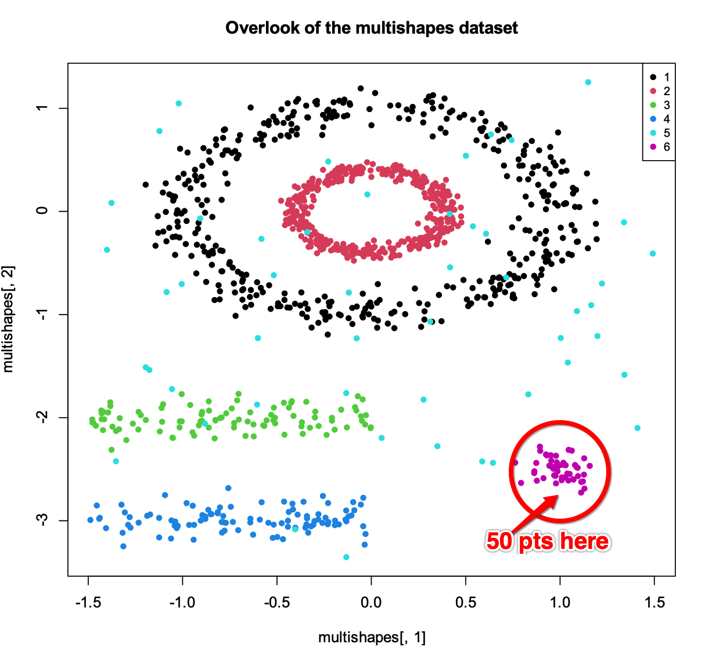
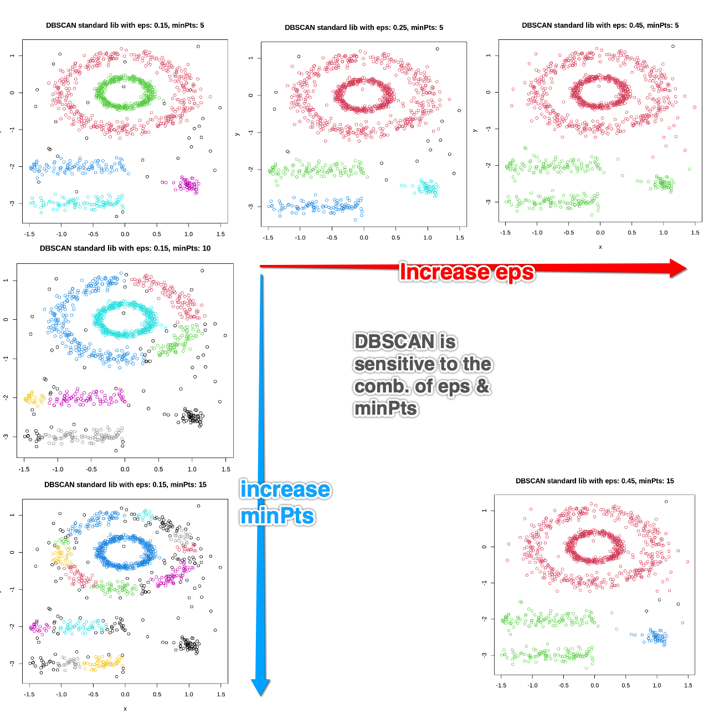
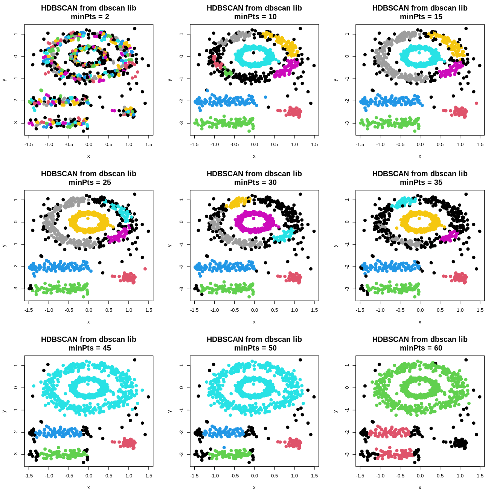
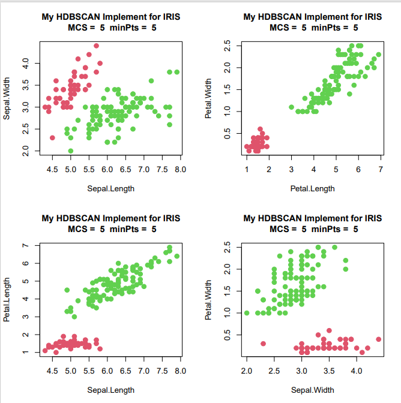
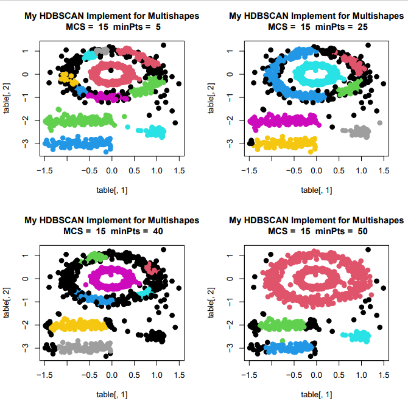
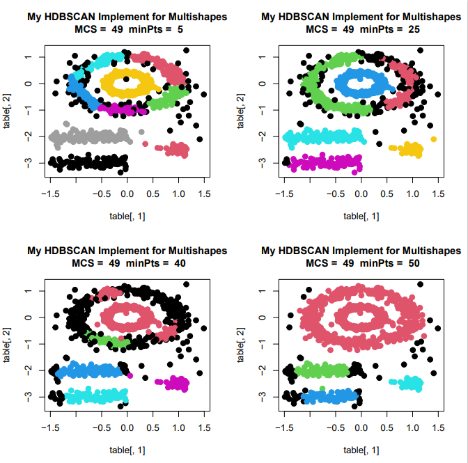

# Assignment4 K-Mean vs HDBSCAN
 Yaowen Mei (1177855)

---
## Step-0: Setup R environment

```
# import the conda R 4.1.0 environment from the conda yml file
conda env create -n R4_1_0 -f environment.yml
conda activate R4_1_0
```

## Step-1: Setup Hadoop Docker Container and save csv files to HDFS
I am basically following [this medium post](https://towardsdatascience.com/hdfs-simple-docker-installation-guide-for-data-science-workflow-b3ca764fc94b) in this step.
1. First, install docker desktop on you PC from this [website](https://hub.docker.com/)
2. Second, setup the Hadoop docker image in your docer, there will be 3 steps, namely to be 1) Clone, 2) Build, and 3) Run:
    1. make a directory under the current folder to **Clone** the hadoop docker image
    ```
    >> mkdir DockerImageFolder
    >> cd DockerImageFolder
    >> git clone https://github.com/big-data-europe/docker-hadoop
    >> cd docker-hadoop
    ```
    2. now, **Build** the docker image and create containers. This command will download all the images that are in need and setup all the containers as per the docker-compose.yml file.
    ```
    >> docker-compose up -d
    ```
    3. After all the download and installation done, we should already have 5 containers **Running** now, the following thing should show in your terminal:
    

    we can also check the status of all these containers any time with the command below:
    ```
    >> docker container ls
    ```
3. Now it's time to store the csv files in the HDFS running in the docker image now.
```
# move back to the project root folder from docker-hadoop\ folder
>> cd ..\..

# make sure the R environment we just build is activated
>> conda activate R4_1_0

# upload the two csv files to hdfs
>> Rscript .\step1_setup_docker.r
```
---
## Step-2 Run build-in K-Mean and Visualize the Result
Run the following command to read csv from hdfs and conduct K-Mean cluster and display the result as picture:

```
>> Rscript .\step2_kmean.r
```

The result pictures are saved in a pdf file, called `KMean_Plot.pdf`.






As we can see from pictures above, the K-Mean did a good job in seperating Iris dataset, this is a 4-D dataset, cannot be displayed in 2D, so I choosed 4 sections to show the result, as we can see from these 4 sections, most of the clusters are seperated from the others, there is a little bit intersection between cluster 2 and 3, but in the picture of Petal.Length vs Sepal.Length, they are totally seperated. Therefore, K-Mean clustering is working good on this dataset.

However, I fund that K-Mean did poorly on the multishapes database. Espeically for the two halo circles at the top. This is because k-Mean assumes the clusters should be round shape, same density, and have less noise. We will see in the next section how HDBSCAN can prevent this. 

---
## Dive Deep Before We Start Implementing HDBSCAN
All the code and plots in this section are [in this Colab file.](https://colab.research.google.com/drive/1BXKsXtT_O_wn7GgpCXZYLKAUXXeKEyvQ?usp=sharing) Anyone click this link has access as commenter.
### 1. First, let's have a overlook of the multishapes dataset

The first thing we notice is that the smallest cluster is cluster 6 with size of 50 pts, which means our <span style="color:red"> **MCS** parameter should not greater than 50</span>
, otherwise, cluster 6 will be treated as noise points, which does not make sense. 

### 2. Second, let's see how **DBSCAN** (not HDBSCAN) solves K-Mean's limitation on this dataset
We have already seen that K-Mean did a bad job in clustering this dataset due to the fact of
* difference points density
* difference cluster size
* Non-round cluster shape

Let's have a quick look at how good the standard DBSCAN lib can solve this problem:


As we can see from the picture above, on the upper-left corner, DBSCAN did a good job in clustering this dataset; However,
this clustering is not stable respect to `eps` parameter and `minPts` parameter. 

I have increased eps value from 0.15 to 0.45 in the row direction, and incrased minPts from 5 to 15 in col direction,
as we can see DBSCAN is returning non-idea result in each case.

### 3. Third, have a quick look at the performance of the `hdbscan` implemented in `dbscan` CRAN library

Surprisingly, the [off-the-shelf implementation of `hdbscan`](https://cran.r-project.org/web/packages/dbscan/vignettes/hdbscan.html) didn't perform well for this dataset.
Please note that the current `hdbsan` implementation in R has only one parameter, `minPts`, which is the `min cluster size`, and is also the `min points` involved to calculate core-distance.

The justification of making `min points` equals `min cluster size` is given in [Campello's origin 2013 paper](https://link.springer.com/chapter/10.1007/978-3-642-37456-2_14):
> To make HDBSCAN more similar to previous density-based approaches and to simplify its use, we can set mclSize = mpts, which turns mpts into a single parameter that acts as both a smoothing factor and a threshold for the cluster size.

As you can see blew, I have tried different `minPts` values from 2 to 60, but none of results is reasonable.



To be honest, I do not really think this dataset can have a reasonable (Robust) clustered result generated by HDBSCAN,
but, anyways, I am going to try to make `min points` **NOT** equal to `min cluster size` in my HDBSCAN implementation 
so that I will obtain an extra hyperparameter to tweak. 
Hopefully this will make my result better than this off-the-shelf solution.

---

## Step-3 HDBSCAN on these two dataset
Run the following command in terminal to read these two csv files and generate the HDBSCAN plots.
```
Rscript .\step3_hdbscan.r
```
All the result plots are saved in a file called `Hdbscan_Plot.pdf`

For the iris dataset, as we can see, the iris dataset cannot be sepearted as 3 cluster via hdbscan algo. Hdbscan thinks that there are only two clusters in the iris dataset.

This is due to the fact that hdbscan is a soft clustering method, and when two clusters are having overlaps, hdbscan cannot easily identify and seperate them.

Comparing to the K-Mean's result, K-Mean did a better job in this dataset.



For the multishapes dataset, as we disscussed above, hdbscan provides a result better than K-Mean, but not as good as dbscan.

I have ploted hdbscan result with different MCS (min cluster size) and minPts (num of points to calculate core-distance).

